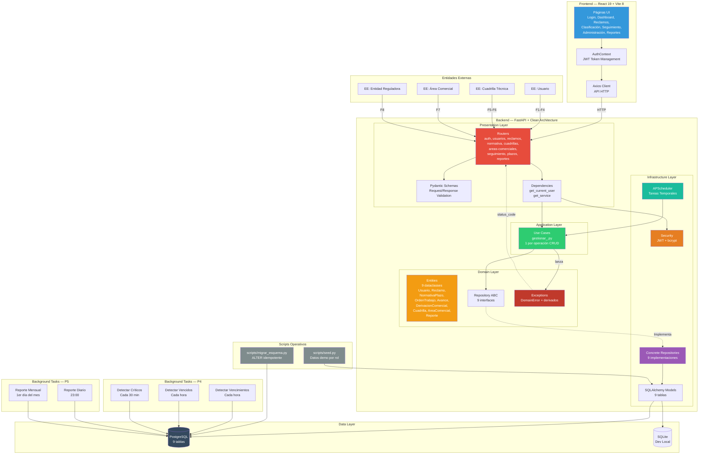
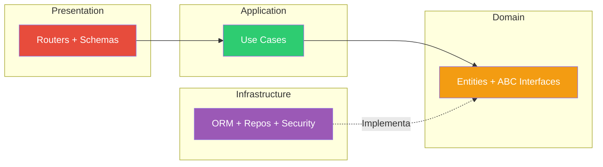
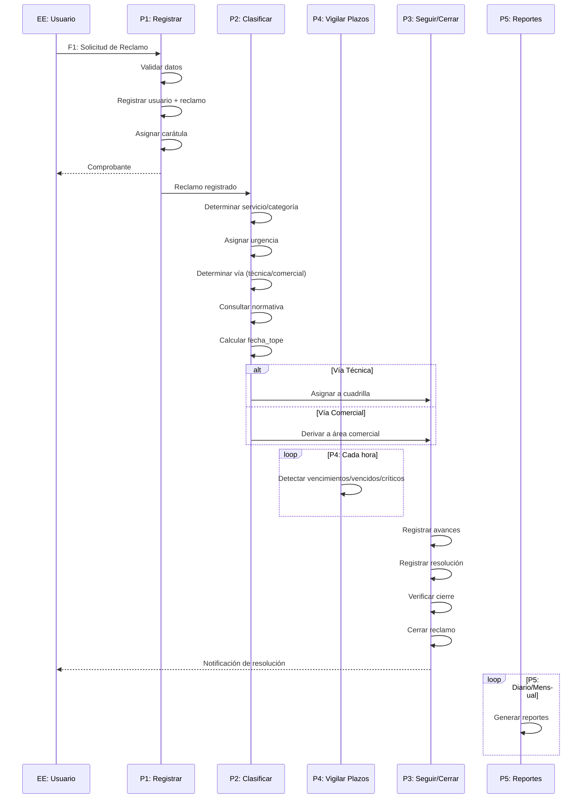
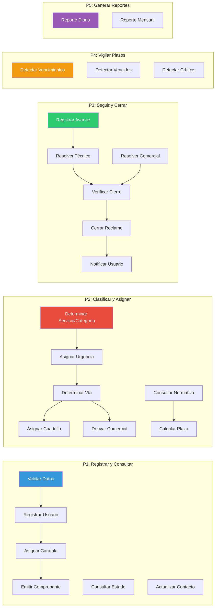

# Arquitectura del Sistema — Atención de Reclamos de Servicios Básicos

## Diagrama de Arquitectura General



---

## Diagrama de Dependencias — Clean Architecture



> **Regla estricta:** Las dependencias van de Presentation → Application → Domain ← Infrastructure. Domain **nunca** importa de Infrastructure ni Presentation.

### Errores de dominio

Los use cases lanzan `DomainError` (o sus derivados) desde `app/Domain/Exceptions.py`, nunca
`HTTPException`. `app/main.py` registra un handler que traduce cada excepción a su
`status_code`:

| Excepción | HTTP | Cuándo |
|-----------|------|--------|
| `NoEncontradoError` | 404 | El recurso no existe |
| `DuplicadoError` | 400 | Documento ya registrado |
| `ConflictoError` | 409 | Transición de estado inválida |
| `ValidacionError` | 422 | Valor fuera de catálogo o regla de negocio |
| `SinPermisosError` | 403 | Rol insuficiente |

---

## Seguridad y Roles

Cada usuario tiene un `rol` en `usuarios.rol` (`Rol` en `app/Domain/Entities/catalogos.py`).
El token JWT lleva el rol, pero `get_current_user` **re-consulta la BD en cada request**, así
que cambiar el rol de un usuario surte efecto inmediato sin esperar que expire el token.

```python
INTERNO = (Rol.tecnico, Rol.supervisor, Rol.admin)   # catálogos + operación de reclamos
GESTION = (Rol.supervisor, Rol.admin)                # escritura, cierre, reportes, dashboard
ADMIN   = (Rol.admin,)                               # CRUD de usuarios, borrado de reclamos
```

`POST /auth/register` es público pero siempre asigna `ciudadano`. Solo `POST /usuarios/`
(admin) crea usuarios con otro rol. Los ciudadanos están acotados a sus propios reclamos y
su propio perfil: el filtro `id_usuario` se sobrescribe con el del token y cualquier
reclamo ajeno devuelve `403`. La matriz completa por endpoint está en `docs/API.md`.

El hash de contraseña nunca sale por la API. `UsuarioRepository.update()` no escribe el hash;
para contraseñas existe `actualizar_contrasena()`, expuesto en
`PUT /usuarios/{id}/contrasena`.

---

## Diagrama de Flujo — Ciclo de Vida de un Reclamo



---

## Modelo de Datos — DER

```mermaid
erDiagram
    USUARIO {
        int id_usuario PK
        string nombre
        string documento
        string telefono
        string contraseña_hash
        string email
        string direccion
        string rol
    }

    RECLAMO {
        int id_reclamo PK
        int id_usuario FK
        int id_normativa FK
        date fecha_recepcion
        string canal
        string servicio
        string categoria
        string urgencia
        string descripcion
        string estado
        date fecha_tope
        date fecha_cierre
        string resultado
    }

    NORMATIVA_PLAZO {
        int id_normativa PK
        string servicio
        string categoria
        string urgencia
        int plazo_maximo_dias
        date vigencia_desde
    }

    ORDEN_TRABAJO {
        int id_orden PK
        int id_reclamo FK
        string cuadrilla
        date fecha_asignacion
        string estado_orden
    }

    AVANCE {
        int id_avance PK
        int id_orden FK
        date fecha_avance
        string descripcion
        string estado_parcial
    }

    DERIVACION_COMERCIAL {
        int id_derivacion PK
        int id_reclamo FK
        date fecha_derivacion
        string area_comercial
        string estado_derivacion
    }

    CUADRILLA {
        int id_cuadrilla PK
        string nombre
        string especialidad
        int capacidad
        string contacto
    }

    AREA_COMERCIAL {
        int id_area PK
        string nombre
        string tipo
        string contacto
    }

    REPORTE {
        int id_reporte PK
        string tipo_reporte
        string periodo
        datetime fecha_generacion
        string contenido
    }

    USUARIO ||--o{ RECLAMO : presenta
    NORMATIVA_PLAZO ||--o{ RECLAMO : establece_plazo
    RECLAMO o|--o| ORDEN_TRABAJO : genera
    RECLAMO o|--o| DERIVACION_COMERCIAL : deriva
    ORDEN_TRABAJO ||--o{ AVANCE : registra
```



---

## Subsistemas — DFD Nivel 1



---

## API Endpoints

| Método | Ruta | Descripción | Rol mínimo |
|--------|------|-------------|:----------:|
| POST | `/auth/login` | Iniciar sesión | Público |
| POST | `/auth/register` | Registrar usuario (siempre `ciudadano`) | Público |
| GET | `/reclamos/estado/{id_o_doc}` | Tracking del reclamo | Público |
| PUT | `/usuarios/{id}/contrasena` | Cambiar contraseña | Propio usuario |
| GET | `/usuarios/` | Listar usuarios | `supervisor` |
| POST | `/usuarios/` | Crear usuario con rol | `admin` |
| DELETE | `/usuarios/{id}` | Eliminar usuario | `admin` |
| GET | `/usuarios/{id}` | Ver usuario | Propio o interno |
| PUT | `/usuarios/{id}` | Actualizar usuario | Propio (sin `rol`) o `admin` |
| GET | `/reclamos/` | Listar reclamos | `ciudadano` ve los suyos, `tecnico` todos |
| POST | `/reclamos/` | Crear reclamo | `ciudadano` solo a su nombre |
| GET | `/reclamos/{id}` | Ver reclamo | Propietario o `tecnico` |
| PUT | `/reclamos/{id}` | Editar reclamo | `tecnico` |
| PUT | `/reclamos/{id}/clasificar` | Clasificar reclamo | `tecnico` |
| PUT | `/reclamos/{id}/asignar-plazo` | Asignar plazo | `supervisor` |
| PUT | `/reclamos/{id}/resolver` | Resolver reclamo | `tecnico` |
| PUT | `/reclamos/{id}/cerrar` | Cerrar reclamo | `supervisor` |
| DELETE | `/reclamos/{id}` | Eliminar reclamo | `admin` |
| GET | `/normativa/` `GET /cuadrillas/` `GET /areas-comerciales/` | Leer catálogos | `tecnico` |
| POST/PUT/DELETE | de normativa, cuadrillas y áreas | Escribir catálogos | `supervisor` |
| GET/POST/PUT | `/seguimiento/*` | Órdenes, avances, derivaciones | `tecnico` |
| DELETE | `/seguimiento/ordenes/{id}` | Eliminar orden | `supervisor` |
| POST | `/plazos/*` | Verificar vencimientos/vencidos/críticos | `supervisor` |
| GET/POST | `/reportes/*` | Reportes y export Excel | `supervisor` |
| GET | `/dashboard/` | Indicadores | `supervisor` |

> `supervisor` y `admin` heredan todo lo de `tecnico`. Detalle completo en `docs/API.md`.

---

## Esquema y Datos de Prueba

`Base.metadata.create_all()` **no altera tablas que ya existen**: si se agrega una columna al
ORM sobre una base viva, la columna no aparece. Por eso existe `scripts/migrar_esquema.py`,
que aplica `ALTER TABLE ... ADD COLUMN IF NOT EXISTS` de forma idempotente y preserva los
datos. Se ejecuta una vez tras cada cambio de esquema.

`scripts/seed.py` carga un usuario por rol (documentos `10000001`–`10000004`, contraseña
`clave123`), normativa, cuadrillas, áreas comerciales y reclamos de ejemplo. Es idempotente.
`--reset` borra únicamente lo que el propio script creó —se identifica por documento, nombre
y tuplas de catálogo, nunca "todo lo que hay en la tabla"— y vuelve a insertarlo.
