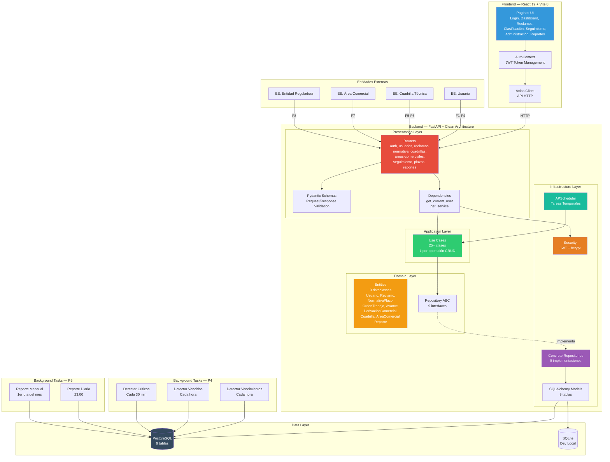
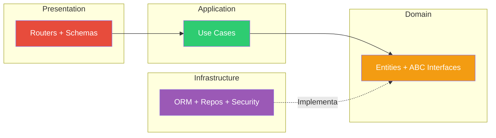
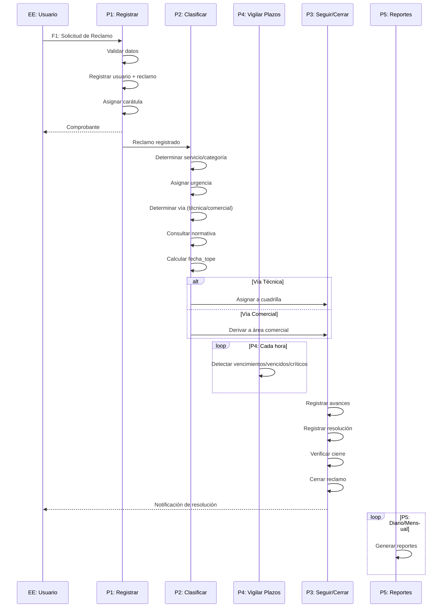
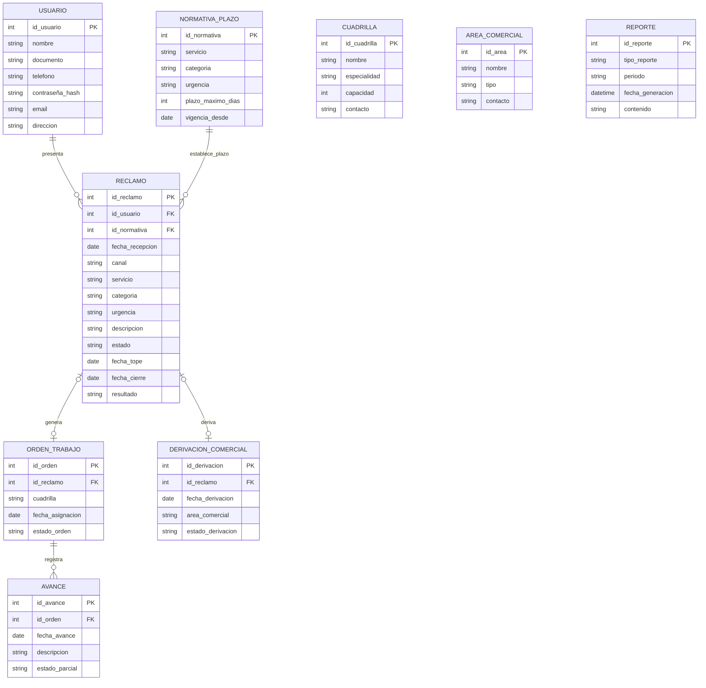
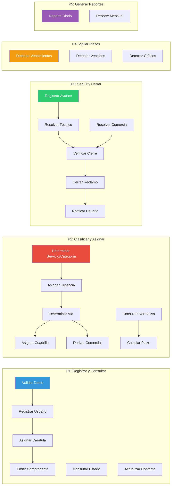

# Arquitectura del Sistema — Atención de Reclamos de Servicios Básicos

## Diagrama de Arquitectura General

---

## Diagrama de Dependencias — Clean Architecture

> **Regla estricta:** Las dependencias van de Presentation → Application → Domain ← Infrastructure. Domain **nunca** importa de Infrastructure ni Presentation.

---

## Diagrama de Flujo — Ciclo de Vida de un Reclamo

---

## Modelo de Datos — DER

---

## Subsistemas — DFD Nivel 1

---

## API Endpoints

| Método | Ruta | Descripción | Auth |
|--------|------|-------------|------|
| POST | `/auth/login` | Iniciar sesión | No |
| POST | `/auth/register` | Registrar usuario | No |
| GET | `/usuarios/` | Listar usuarios | Sí |
| POST | `/reclamos/` | Crear reclamo | Sí |
| PUT | `/reclamos/{id}/clasificar` | Clasificar reclamo | Sí |
| PUT | `/reclamos/{id}/resolver` | Resolver reclamo | Sí |
| PUT | `/reclamos/{id}/cerrar` | Cerrar reclamo | Sí |
| POST | `/plazos/verificar-vencimientos` | Verificar plazos | Sí |
| POST | `/reportes/diario` | Generar reporte | Sí |
